# Prototipo juego 2D

## Concepto
El concepto del juego es similar a el que podemos encontrar en google chrome cuando nos quedamos sin internet.

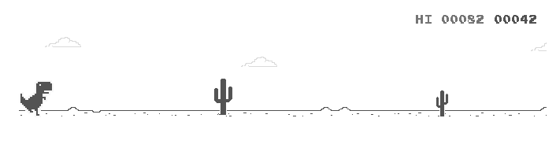

Se trata de un juego en el que hay que esquivar a los enemigos que aparecen saltando. 

Cada vez que se consigue esquivar a uno, obtenemos un punto. 
Cuando no logramos esquivar a uno, resta una vida.
Cuando nos quedamos sin vidas se acabó el juego.

## Flujo de juego

El juego está dirigido por [GameManager.cs](Assets/Scripts/GameLogic/GameManager.cs), este está conectado a todos los sistemas que se explicarán a continuación para alterar su estado según el estado del juego.

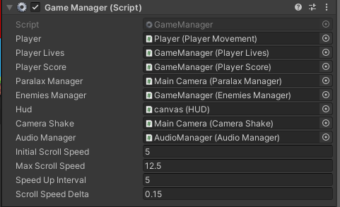

[PlayerLives.cs](Assets/Scripts/GameLogic/PlayerLives.cs) Se encarga de llevar la cuenta de las vidas que tiene el usuario y proporciona métodos y eventos para su uso en otros sistemas.

[PlayerScore.cs](Assets/Scripts/GameLogic/PlayerScore.cs) Se encarga de llevar la cuenta de los puntos que tiene el usuario y proporciona métodos y eventos para su uso en otros sistemas.
Además también lleva la cuenta de la mejor puntuación alcanzada, que se guarda localmente mediante el uso de `PlayerPrefs`.

[EnemiesManager.cs](Assets/Scripts/Enemies/EnemiesManager.cs) se encarga de mantener las pools para las instancias de enemigos, su creación y destrucción y la velocidad a la que se hace spawn de nuevos enemigos.

Existen dos tipos de enemigos, "LowEnemy" y "HighEnemy", siendo las cajas y el águila respectivamente.

Los enemigos deberán tener un script [Enemy.cs](Assets/Scripts/Enemies/Enemy.cs) como mínimo, además del [PoolObject.cs](Assets/Scripts/Enemies/PoolObject.cs) si queremos usar la pool de objetos.

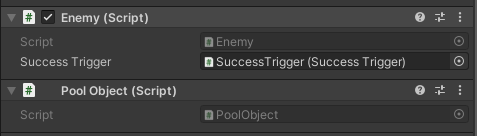

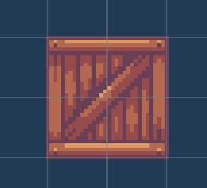
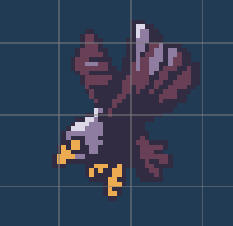

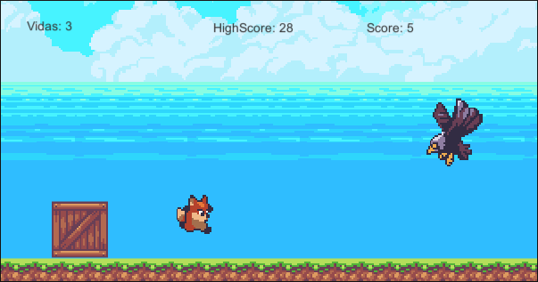

## Control de puntuación

Cada enemigo tiene un collider isTrigger suficientemente grande para que cuando el jugador esquive al enemigo le sume a su puntuación. Este comportamiento está difinido en [SuccessTrigger.cs](Assets/Scripts/Enemies/SuccessTrigger.cs)

Si el jugador colisiona directamente con el enemigo, se notifica al [GameManager.cs](Assets/Scripts/GameLogic/GameManager.cs) para restarle una vida.

## Control de personaje

El control del personaje está definido en [PlayerMovement.cs](Assets/Scripts/Movement/PlayerMovement.cs), donde se pueden seleccionar las teclas para el control y otros parámetros como la velocidad y la fuerza del salto. Se utiliza el Rigidbody y el sistema de físicas de Unity para mover al personaje por la pantalla.

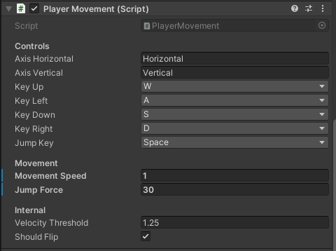

Por otro lado para mover el personaje hacia atrás todo el tiempo y dar el efecto de movimiento por una planicie, se mueve el personaje mediante el transform, ya que de otra manera afectaríamos al sistema de físicas.

## Control de cámara

Para el control de cámara, se ha desarrollado comportamiento personalizado y no se ha usado Cinemachine.

Se tiene un script [ParalaxManager.cs](Assets/Scripts/Camera/ParalaxManager.cs) que se encarga de mover continuamente dos capas de objetos en una direccion continuamente, no es relacionado con la cámara pero es necesario que la cámara siempre tenga en foco a los elementos de las capas debido al uso de [RendererScreen.cs](Assets/Scripts/Movement/RendererScreen.cs)

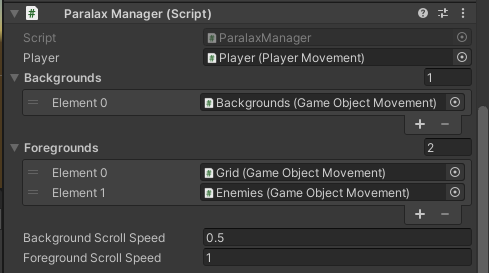

Además de esto, tenemos el script [CameraShake.cs](Assets/Scripts/Camera/CameraShake.cs) que nos da un método para hacer una vibración en la cámara. Esto se usa cuando el personaje se hace daño.

Por último también se incluye en la cámara un script [CameraLimits.cs](Assets/Scripts/Camera/CameraLimits.cs) que se encarga de que el jugador no pueda salir de los límites que muestra la cámara, poniendo colliders en los extremos.

Es importante para que funcione correctamente, hay que poner la cámara en una capa por separado y especificar que esta capa sólo puede colisionar con la capa del usuario.

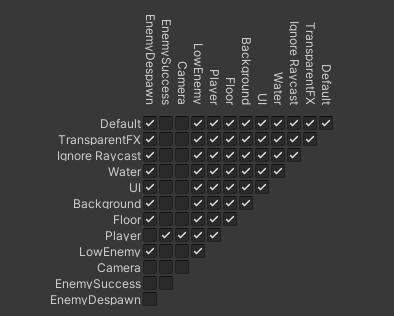

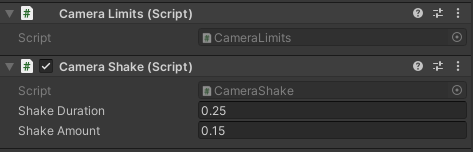

## Control de enemigos

Para el control de los enemigos, se usa [Enemiesmanager.cs](Assets/Scripts/Enemies/EnemiesManager.cs), que se encarga de gestionar todo lo relacionado con los enemigos.

Para hacer el movimiento de los enemigos, se incluyen como hijos en un gameobject vacío que se tratará como primer plano para el sistema de paralaje, de esta manera se mueven a la misma velocidad que el suelo. 

## Control del HUD

Para el control del HUD, se usa [HUD.cs](Assets/Scripts/Camera/HUD.cs) que se encarga de escuchar de [PlayerScore.cs](Assets/Scripts/GameLogic/PlayerScore.cs) y de [PlayerLives.cs](Assets/Scripts/GameLogic/PlayerLives.cs) los eventos que tienen para actualizar los valores que aparecen en pantalla.

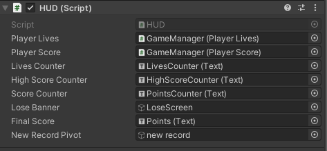

### HUD al inicio del juego
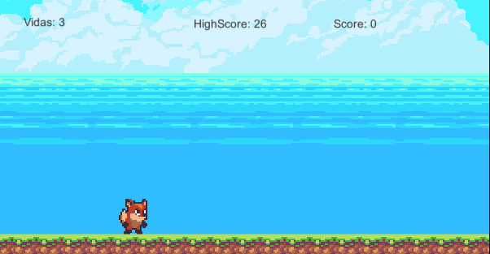

### HUD al perder
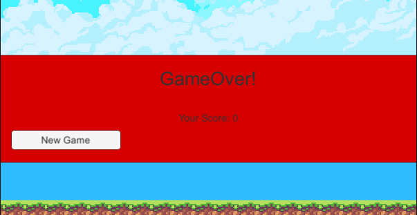

### HUD al perder, variante cuando se ha hecho un nuevo record
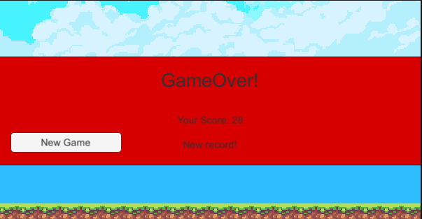

## Control de audio

Para el audio se usa [AudioManager.cs](Assets/Scripts/AudioManager.cs) para especificar los `AudioClip`s que vamos a usar y luego poder reproducirlos mediante código.

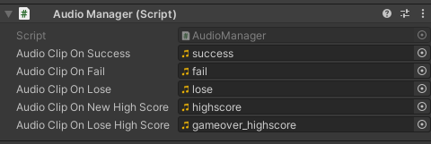

# Gif de ejecución

